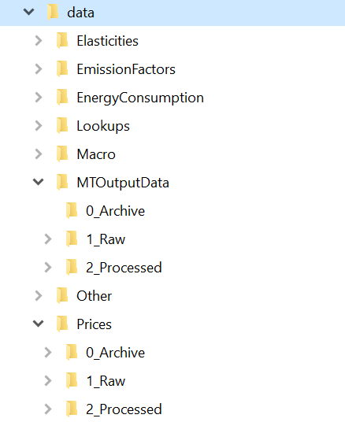
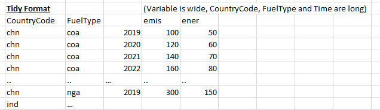
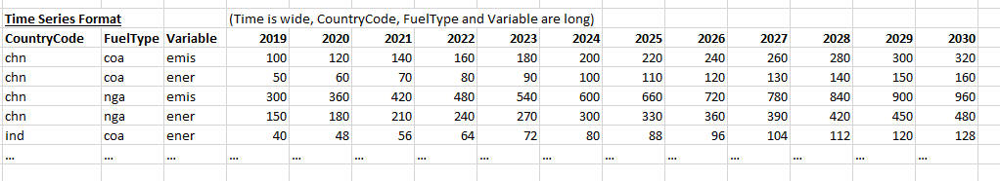

```{r setup, include=FALSE}
knitr::opts_chunk$set(echo = TRUE)
```
# Data quick-start guide {.tabset}

## Presentation {.tabset}

The CPAT repository includes a folder devoted to data, where datasets at different levels of processing are stored under subfolders by theme.

$~$

```{r echo=FALSE, fig.cap="Data folder structure", fig.align = 'center', out.width="25%"}
#knitr::include_graphics("data/Other/Pictures/DataFiles.PNG")

```

$~$

As it can be seen from the figure above, whenever needed, a folder can be divided into three subfolders to split processed data from the rest:

* **0_Archive**: Records raw older versions of raw and processed information to be used when replicating older studies/results. Datasets contained in this folder should hold a time-stamp in the name stating the date of update (dd-mm-yyyy).

* **1_Raw**: Data without processing as it came from the source. This is the folder from which existing scripts will read the data to produce the files stored under "2_Processed". Ideally, this should only hold the latest examples of each dataset, with older versions stored under the "0_Archive" folder.

* **2_Processed**: Information at different levels of processing is stored under this folder. The most common transformations include two formats of data: long, and matrix-column datasets.

In what follows, this guide provides a quick-start into common terminology used to define our datasets, and some example scripts to extract the information in them.


## Terminology

For a common ground on discussions regarding our data structures, processing levels, and the usage of each type of data format for different purposes, this guide provides a quick overview of some frequently-used terminology.

In general, data in our repositories is divided into three categories:

* **Input data**: datasets taken in raw form from international sources. This includes, among others,the WEO-IMF dataset, the Energy Balances extracted from the IEA-OECD iLibrary, and the IMF dataset on domestic fossil fuel prices and subsidies.

* **Output data**: datasets obtained by running the Multi-scenario tool (MT). These sets of information correspond to the extraction of the MTOutput tab that stores the results of the simulations on the MT Excel tool. Among others, it stores the runs done to retrieve simulations results for projections, calibration, or hindcasting (validation).

* **Processed data**: Extractions, or other forms of transformations of input or output data into formats -or under sets of assumptions- consistent with CPAT. This also includes Lookups and other key tables resulting from WB or IMF team's analysis and stored in CPAT (i.e. elasticities, emissions factors, etc).

$~$

Furthermore, when defining the datasets structures, the terms "long", "wide" can be used to describe whether a 'dimension' is expressed as a single ID column (long format), or whether each instance is expressed as a different column (wide format). Usually, only one variable can be wide, except for the D matrix form. If needed, transforming a long table into a time series or tidy format is feasible and extremely simple, often simpler than moving in the other direction. 

[]

A brief description of each case is presented below.

In this time series example, the dimensions are Country, FuelType and Year. Country and FuelType are expressed in 'Long' format (dimensions are also called 'ID variables'), whereas Year is expressed in 'Wide' format, in this time series example. There are two variables (emis and ener), which are expressed here in Long format.

* **Fully long format**: A fully long format is when all dimensions AND variables are in long format. It's usually used as an intermediary between when using the pivot_longer and then pivot_wider. These functions (from the tidyr package) take the form longdata = widedata %>% pivot_longer(cols=start:end,values_to="Value", names_to="Name") (where the columns to be made long are start:end) and widedata = longdata %>% pivot_longer(values_from="Value", names_from="Name")

* **Tidy format**: A tidy dataset is one where all dimensions (including time) are expressed in a long form whereas each *variable* (for example, GDP, Inflation etc) is presented in its own column. It is the ideal workhorse for data analysis. It has a column for each category, and one column where all numerical values are stored. Each observation is stored under a new row. For time series, this means that the time dimension will be in the rows, or equivalently, that 'Time/Year/period' will be a variable (column) on its own. The figure below represents how the original data would be presented in tidy format:

```{r echo=FALSE, fig.cap="Long table format", fig.align = 'center', out.width="40%"}

```


* **Time Series format**: Datasets often come in time series format (years on the columns). In what follows, we will refer to these formats as "wide" tables. These are normally useful as output/report formats given its target towards improving human readability. 

```{r echo=FALSE, fig.cap="Long table format", fig.align = 'center', out.width="40%"}

```

* **Matrix-column format (Tidy+Time Series)**: For the CPAT-R conversion, the long format is convenient for reporting and plotting, but not for recursive calculations. An additional transformation is useful for such purpose. For CPAT, this is also known as a **D-matrix**. A tibble (data-frame) object where the first columns correspond to the identificators of the observation (CountryCode, RegionCode, SectorCode, FuelType, etc.), and each additional column is a variable from CPAT. It should be noted that the identificators do not include time, as time is already stored in the variables. Indeed, the column holding the data for a variable, is actually a matrix on itself, where the rows correspond to the rows of the identificators in the tibble, and the columns to the years for which we have observations. This object is known as a "matrix-column". If matrix-columns for all variables are stored with the same dimensions/structure, recursive calculations and model operations can be computed in a straightforward manner, even without needing to use matrix operations. For further details on matrix columns, see <https://www.ericrscott.com/post/matrix-columns/>.

```{r echo=FALSE, fig.cap="Matrix-column format", fig.align = 'center', out.width="90%"}
knitr::include_graphics("Other/Pictures/Dmatrix.PNG")
```


## Input data: sample scripts {.tabset}

### Domestic Prices

The IMF dataset for domestic prices and subsidies is a key source of information for the mitigation module. Built from information provided by WB and IMF country teams, and complemented with the help of international databases, it is at the core of the process used to forecast domestic fossil fuel prices.

In its raw format, the dataset is structured so that the Country and Year are in the rows of the table, while the fuel type, the sector consuming it and the price components are in the columns. The code below shows an extraction of the first rows of the database.


```{r Domestic Prices 1, warning=FALSE, message=FALSE}
# NOTE: The script on which this code is used, has to be opened with the "cpatr" project so that it has is working directory at the root of the project. The path to the required files would assume that to be the root.
# Loading required packages
library(dplyr)
library(tidyverse)
library(magrittr)
library(readxl)
# Name of latest/required file with domestic prices (WITHOUT xlsx extension explicitly mentioned)
FilePrices        <- 'prices_for_cpat_all_years_LATEST'
# NOTE:
# Whenever using an R script created as part of the 'cpatr' project, the working directory is by default that of the project.
# In such case, the line below should read:
# RawHistDomPrices  <- read_excel(paste0('data/Prices/1_Raw/', FilePrices,'.xlsx'))
# For the current document, the working directory is set to the location of this file, and hence a different path is needed:
RawHistDomPrices  <- read_excel(paste0('Prices/1_Raw/', FilePrices,'.xlsx'))
```
Printing the first 10 rows of the table:

```{r Domestic Prices 2, warning=FALSE, message=FALSE}
head(RawHistDomPrices, 10)
```


A simple example code to transform the above information to a long/tidy format, is given below.

```{r Domestic Prices 3, warning=FALSE, message=FALSE}
 
DomPricesLong     <- RawHistDomPrices %>%
                      # Dropping some redundant or not-needed columns
                      select(-c(country_year,
                                countrycode_weo,
                                starts_with('floating_'))) %>%
                      # Adopting CamelCase convention for column names:
                      rename(CountryCode = countrycode,
                             Country     = countryname,
                             Year        = year) %>%
                      # Ensuring numeric columns are read as such, and not as character strings:
                      mutate(across(.cols = starts_with("mit_"), .fns = as.numeric)) %>%
                      # Selecting a subset of columns to keep for further transformations:
                      select(CountryCode, Country, Year, starts_with('mit_')) %>%
                      # Transforming the 'wide' table into long format:
                      pivot_longer(cols = starts_with('mit'),names_to = 'OldCPATCode',values_to = 'Value') %>%
                      # Retrieving identificators and key information from the old CPAT code.
                      separate(OldCPATCode, into = c('Module', 'Indicator', 'FuelType', 'SectorGroup')) %>%
                      # Dropping the module ID, as it is redundant:
                      select(-Module)
```

An extraction of the data for 2019 on the resulting table would look like:

```{r Domestic Prices 4, warning=FALSE, message=FALSE}
head(DomPricesLong %>% filter(Year == 2019), 10)
```

Moreover, if this resulting table is intended to be stored for further analysis, one could save it as an RDS file:

```{r Domestic Prices 5, warning=FALSE, message=FALSE}
# Storing this intermediate output for users needing the original table in long format
saveRDS(DomPricesLong, paste0('Prices/2_Processed/Long_Example'))
```

### Energy Consumption

There are two types of energy consumption tables in CPAT, the ones with historical data for punctual analysis (calibration, hindcasting, etc.), and the tables used in the live version of CPAT. The former have lower country coverage, as they correspond to a transformation of the IEA's energy balances framework, into energy consumption tables. The latter have an increased coverage, as they also use Enerdata information as inputs for a single year, and correspond to the projections built within CPAT using the model's own assumptions.

Given its relevance and extended use, the script below shows how to read and organize the historical data of energy consumption.


```{r EC 1, warning=FALSE, message=FALSE}
# NOTE:
# Whenever using an R script created as part of the 'cpatr' project, the working directory is by default that of the project.
# In such case, the line below should read:
# RawHistDomPrices  <- read_excel(paste0('data/Prices/1_Raw/', FilePrices,'.xlsx'))
# For the current document, the working directory is set to the location of this file, and hence a different path is needed:
FileName    <- 'EnergyConsumption_1990_to_2019'      # NOTE: This is a csv file
# Time coverage of the current dataset
YearVector  <- c(1990:2019)
  
RawEC       <- read_csv(paste0("../data/EnergyConsumption/",FileName,'.csv'))
```

The raw information is presented in table format, with country codes, years and fuel types on the rows, and sector codes on the columns:

```{r EC 2, warning=FALSE, message=FALSE}
head(RawEC, 10)
```

This could be transformed into long format, with the first few lines of the new output depicted below:

```{r EC 3, warning=FALSE, message=FALSE}
LongEC      <- RawEC %>%
                # Adopting PascalCase convention
                rename('CountryCode' = country_code,
                       'Year' = year) %>%
                # Transforming to long format
                pivot_longer(cols = c('ele':'wav'), names_to = 'SectorCode', values_to = 'Value') %>%
                # Dropping an extra column (not-needed)
                select(-'...1') %>%
                # Filtering out sectors that won't be used for the time being
                filter(! SectorCode %in% c('ele', 'wav', 'neu'))
head(LongEC, 10)
```


### Building a D-matrix

Consider the dataset on domestic prices in its long format. The following will show a quick script to select a couple of price components and transform those into a D-matrix type of object

```{r D-mat 1, warning=FALSE, message=FALSE}
# Working with an extraction of the prices dataset in long format
PriceSubset       <- DomPricesLong %>%
                      filter(Year %in% c(2015:2019),              # Selecting only data from (2015 to 2019):
                             Indicator %in% c('sp','rp')) %>%     # Using supply cost [sp], and retail price [rp] as examples
                      # Pivoting towards a wide table, with years in the columns
                      pivot_wider(names_from = Year, values_from = Value)
# Initializing the D matrix with a set of identificators from the tibble above:
D                 <- PriceSubset %>%
                      select(CountryCode, SectorGroup, FuelType) %>%
                      # Keep only unique observations, *and arrange them*
                      distinct()
# Applying the process for each variable to add as matrix column to the tibble
for(j in unique(PriceSubset$Indicator)){
    TempData      <- PriceSubset %>%
                      filter(Indicator == j) %>%
                      # Note the use of '' to avoid having numbers being read as indexes (column positions) 
                      select(CountryCode, SectorGroup, FuelType, c('2015':'2019'))
    
    TempID        <- TempData %>% select(CountryCode, SectorGroup, FuelType)
    TempMatrix    <- as.matrix(TempData %>% select(c('2015':'2019')))
    
    # Creating a temporary tibble with indicators and a matrix column:
    # Notice the use of '{}' and := on the assignment of the values to a dynamic name
    TempTib       <- tibble(TempID, '{j}' := TempMatrix)
    
    D             <- D %>%
                      left_join(TempTib, by = c('CountryCode','SectorGroup','FuelType'))
  
}
head(D)
```
The names of the columns to the right of the identificators in the table above already hint about a different structure. The notation *sp[,'2015']* suggest we are reading information from a **matrix column** 'sp', and within that matrix, that the data depicted corresponds to the column named '2015'.

The matrix column makes it easier to reference the entire time series for a variable and to apply calculations between multiple variables for all years. Extracting the time-series in matrix format for a single variable, say *sp*, can be done by simply using the code *D$sp*. It should be noted, however, that this does not consider the identification columns (Country, sector, fuel), but preserves the order of those rows unless otherwise specified.

The column-matrix format supports matrix operations, but also element-by-element ones when the dimensions are consistent. For instance, let *sp_rp* represent the ratio between supply cost and retail price, for all sectors, fuels and years. Such ratio is an element-by-element ratio between two matrices. The operation to obtain it can be specified as:

```{r D-mat 2, warning=FALSE, message=FALSE}
# Ratio: sp/rp
sp_rp     <- D$sp / D$rp
# Printing the first lines of the resulting matrix:
head(sp_rp, 10)
```


Finally, it should be noted that matrix columns also support several *dplyr* operations, like filtering or arranging (in general, operations applied to rows across all matrix-columns). However, it appears as an object in testing and development phase, so other more complex operations like the ones linked to the *summarise()* function, may require the long format of the table to be used.


## Output data: sample scripts

As mentioned before, output data refers to the datasets obtained by running the Multi-scenario tool (MT), and extracting the MTOutput. It is often the case that particular analysis would require multiple scenarios to be run for a significant number of countries and to report a large set of indicators. Depending on the scenarios used and the country coverage, the run time of such an exercise could take more than one hour. To generate tractability of previous runs; to enable the reproduction of past analysis made with these results; and to avoid the duplication of time spent into running the MT, the data folder on the repo has a subfolder devoted to storing this files.

Below, there is an example into how to read one of these files, modify its format, storing the resulting table, and creating a summary table for a given indicator.

As usual, the first stage is to load the required libraries

```{r OutputData 1, warning=FALSE, message=FALSE}

library(dplyr)
library(tidyverse)
library(magrittr)
library(readxl)
```

Each MTOutput file has a name that describes the scenarios run, and the version used for that purpose. Archived files have a timestamp on the name, while the latest available version suggests that as part of the name. The user needs to specify the name of the file that will be read. In the example below, the name does not require the file extension, as it should always be a '.xlsx' file.
To distinguish the resulting data from other runs in the future, it is convenient to add some information to the dataset that can be useful for future users. Indeed, the user will include the date in which the MTOutput file was run, so we can differentiate between vintages of files, and also the purpose. This would enable users to select one file or another depending on the analysis needed.

```{r OutputData 2, warning=FALSE, message=FALSE}

################################################################################
# Change here to match the name of the file to be used as input.
MTFileName      <- 'MTO_T5_WB_Latest'

# Date in which the run was performed
DateToAdd       <- "16-05-2022"
PurposeDef      <- 'Calibration, forecasts'

# Vector containing the sequence of years included in MTOutput
AllYears        <- as.character(2019:2036)

################################################################################
```

The example below reads the MTOutput file, focuses on data used for analysis regarding the mitigation module (excludes distributional data from the raw dataset), transforms the table into a long format, and stores it as an RDS object for future analysis.

```{r OutputData 3, warning=FALSE, message=FALSE}

# MT Output after deleting "Dist", renaming columns and transforming it into long format
RawMTOutput     <- read_excel(paste0('../data/MTOutputData/1_Raw/',MTFileName,'.xlsx'))

head(RawMTOutput)
```

Transforming the data into long format
  
```{r OutputData 4, warning=FALSE, message=FALSE}
LongMTOutput    <- RawMTOutput %>%  
                      # Dropping excess columns:
                    select(-starts_with('Dist')) %>%
                    # Ensuring all data years are taken as numbers and not characters
                    mutate(across(.cols = all_of(AllYears), .fns = as.numeric )) %>%
                    distinct_all() %>%
                    separate(RCode, into = c('CountryCode', NA, NA, "Sector", "FuelType", "Other", "Unit", "SubScenNo")) %>%
                    # Transforming to longer version:
                    pivot_longer(cols = all_of(AllYears), names_to = 'Year', values_to = 'Value') %>%
                    # Adding the date in which this particular run was performed
                    mutate('RunDate' = DateToAdd,
                           'Purpose' = PurposeDef) %>%
                    select('Country':'Purpose')

print(head(LongMTOutput))

# Adapting the name of the file, and storing it
MTname_short    <- gsub('Latest', DateToAdd, MTFileName)

# Saving the long format of the current data-set into the processed subfolder for future uses
saveRDS(LongMTOutput, paste0('../data/MTOutputData/2_Processed/Long_',MTname_short))
```

Once the table is organized in long format, one can filter for the desired indicators. Consider the case of the Total energy consumption by fuel type. The example below reads this information and transforms it into a more human-readable table (wide format) to visually check the time series:

```{r OutputData 5, warning=FALSE, message=FALSE}
# Example: Total energy consumption by fuel, for both subscenarios
TotEnerCons   <- LongMTOutput %>%
                  filter(Variable == 'ener') %>%
                  distinct_all() %>%
                  filter(grepl("Total consumption by fuel type", CPATIndicator),
                         SubScenNo == 1)
```
Verify the Indicators included are the desired ones:

```{r OutputData 6, warning=FALSE, message=FALSE}
print(unique(TotEnerCons$CPATIndicator))
```

Create a new table to report data in time series format

```{r OutputData 7, warning=FALSE, message=FALSE}
# Extracting relevant info and Transforming it to wode format (time series):
TotEnerCons     <- TotEnerCons %>%
                    select(CountryCode, FuelType, Year, Value) %>%
                    pivot_wider(names_from = Year, values_from = Value)

# Checking the New table
head(TotEnerCons)


```
